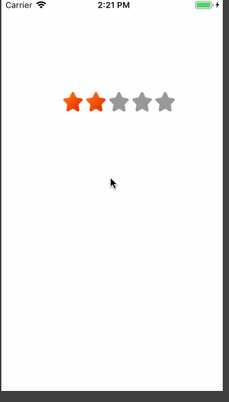

# DZStarView
星级评价控件



```objective-c

- (void)viewDidLoad {
    [super viewDidLoad];
    // Do any additional setup after loading the view, typically from a nib.
    DZStarView *starView = [[DZStarView alloc] initWithMaxCount:5 value:4 canEvlaue:YES frame:CGRectMake(70, 100, 200, 100)];
    starView.delegate = self;
    [self.view addSubview:starView];
}

-(void)starView:(DZStarView *)starView didClick:(NSInteger)index{
    NSLog(@"等级 == %ld",index);
}
```

